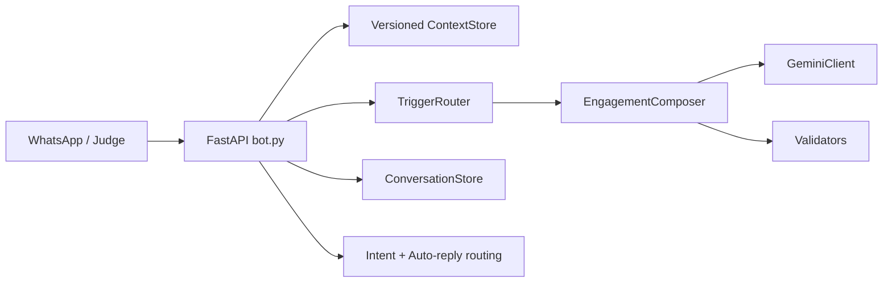

# Vera Merchant Assistant

Vera is a stateful FastAPI bot for the magicpin AI Challenge. It accepts category, merchant, customer, and trigger contexts; routes worthwhile proactive triggers; composes grounded WhatsApp copy; and handles replies with deterministic intent, auto-reply, suppression, and conversation-state logic.

## Architecture



The HTTP layer owns the five challenge endpoints. `ContextStore` keeps the newest context version, `TriggerRouter` filters expiry and suppression, and `ConversationStore` tracks turns and state. The composer uses Gemini when configured and a deterministic fallback when it is unavailable; validator checks reject unsupported facts, taboo vocabulary, duplicate copy, and competing CTAs.

## Run locally

```powershell
python -m pip install -r requirements.txt
uvicorn bot:app --host 0.0.0.0 --port 8080
```

In another terminal:

```powershell
python verify_server.py
python -m pytest tests/ -v
```

Set `GEMINI_API_KEY` and `GEMINI_MODEL` in the environment for live model composition. Do not commit `.env` or credentials. Without a key, the service remains available and uses safe fallback copy.

## Deployment

The service is deployed on Render from this repository. Render runs the `Dockerfile`, which starts Uvicorn on the platform-provided `PORT`.

Live URL: https://magicpin-vera-bot-nvk2.onrender.com/

Useful probes:

```text
GET https://magicpin-vera-bot-nvk2.onrender.com/v1/healthz
GET https://magicpin-vera-bot-nvk2.onrender.com/v1/metadata
```

## Known limitations

- State is in-memory and is lost on process restart or redeploy.
- The local release environment has no usable Gemini credential, so local `compose()` generation and `submission.jsonl` use the deterministic fallback path; production quality depends on a valid Render model configuration.
- Metadata defaults still contain placeholder team/contact values unless Render environment variables override them.
- The local judge requires its own LLM key and is not a deterministic pass/fail test.